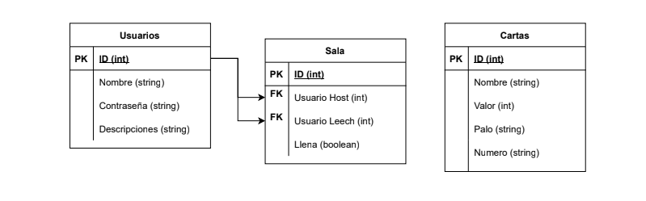

# Proyecto Final
## Truco
### Grupo 5
#### Integrantes:
- Nicolás Gil Rodríguez
- Joacquín Gómez
- Santiago Ivaldi
- Bruno Spataro
___

### ¿Qué vamos a hacer?

En este proyecto final nuestra idea es hacer un Truco, el famoso juego argentino de cartas. Las reglas, obviamente son las mismas del truco original, las cuales aparecerán para que el usuario pueda verlas.

El usuario se tendrá que registrar y podrá jugar solamente un 1v1 online mientras otro jugador esté conectado. Después de registrarse tendrá que iniciar sesión y se tendrá que meter en la sala que esté alguien o en todo caso crearla, la partida se guardará en una base de datos de partidas con su respectivo id. 

Una vez dentro de la partida se jugará la partida normalmente y la partida se elimina y la siguiente se creará con un nuevo id, lo que servirá para registrar cuantas partidas se llevan jugadas.

Base de datos:

#### ¿Cómo anda el juego?
- Te registrás
- Te logueás
- Tenés la pantalla de partidas
- Hay 3 bases de datos, una de las cartas, otra de los usuarios (con admin que puede cambiar cosas) y otra de las partidas
- Admin puede cambiar data del usuario

___

#### División del trabajo
- Nicolás Gil Rodríguez
  - JS
  - HTML
  - Python
- Joaquín Gómez
  - HTML
  - CSS
- Santiago Ivaldi
  - SQL
  - Python
  - JS
- Bruno Spataro
  - HTML
  - CSS
